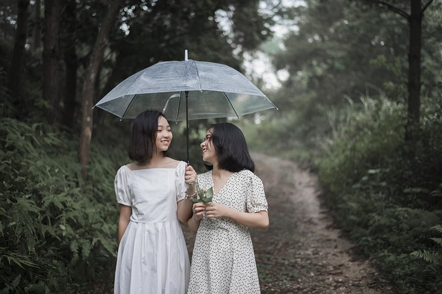
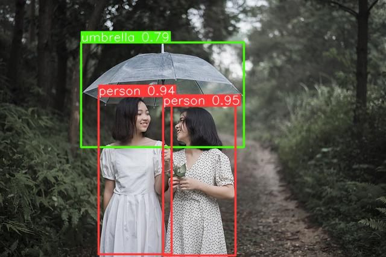

# カメラ映像からYOLOで物体検出
カメラの映像を用いて，YOLOで物体検出します．


## ファイルの説明 (.py)

### test_yolov5.py
Pathを与えた画像に対し，YOLOで物体検出して出力

入力


```console
$ python test_yolov5.py 
YOLOv5 🚀 2023-3-22 Python-3.7.15 torch-1.12.1+cu116 CUDA:0 (NVIDIA GeForce GTX 1080 Ti, 11177MiB)

Fusing layers... 
YOLOv5l summary: 367 layers, 46533693 parameters, 0 gradients
Adding AutoShape... 
umb.jpg
270.09024 175.18948 390.8829 424.11844 0.9521129 0 person
163.85829 159.12924 284.7193 422.369 0.94140965 0 person
134.10526 70.76251 404.49503 244.57758 0.787775 25 umbrella
Saved 1 image to output
```

出力


### camera_yolov5.py
カメラの映像を用いて，YOLOで物体検出して出力

### logger.py
ログ出力用


## ファイルの説明 (.ipynb)

### camera.ipynb
カメラの映像を逐次表示

### camera_yolov5.ipynb
カメラの映像を用いて，YOLOv5でDetectionを逐次行なう

### camera_yolov8.ipynb
カメラの映像を用いて，YOLOv8でDetectionを逐次行なう（実装途中）


## ヒント
* [YOLOの詳細](https://github.com/ultralytics/yolov5)
* [resultで出力できるもの](https://github.com/ultralytics/yolov5/blob/master/models/common.py)